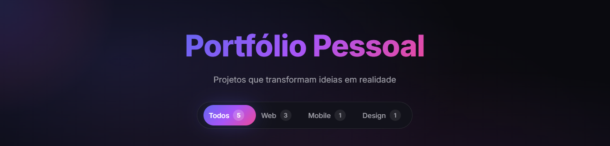
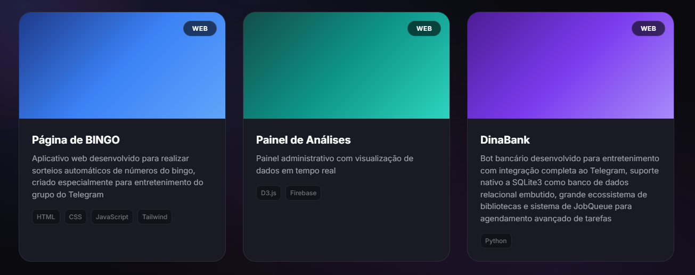
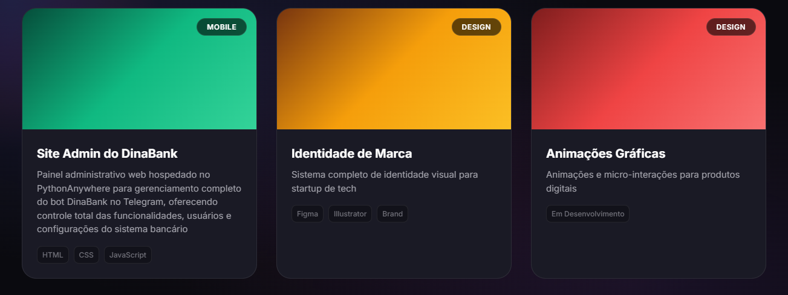

# 🎨 Portfólio Pessoal - Filtro Dinâmico



Um portfólio interativo e moderno com sistema de filtros dinâmicos estilo "chips", desenvolvido para exibir projetos de forma organizada e elegante.

## 📸 Demonstração

<div align="center">
  
  
  
  
</div>

## ✨ Características

- **Filtro Dinâmico Animado**: Sistema de filtros com indicador deslizante suave tipo "pill"
- **Badges de Contagem**: Cada categoria mostra quantos projetos possui
- **Animações Fluidas**: Transições suaves com efeito spring entre categorias
- **Design Moderno**: Interface escura com gradientes vibrantes e efeito glassmorphism
- **Cursor Glow**: Efeito de brilho que acompanha o movimento do mouse
- **Responsivo**: Totalmente adaptável para dispositivos móveis e desktop
- **Cards Interativos**: Animações de hover e transições elegantes nos projetos

## 🚀 Tecnologias Utilizadas

- **HTML5**: Estrutura semântica e acessível
- **CSS3**: Estilização avançada com variáveis CSS, animações e gradientes
- **JavaScript (Vanilla)**: Lógica de filtros e animações sem dependências
- **Python**: Servidor HTTP local para desenvolvimento

## 📂 Estrutura do Projeto

```
Filtro Dinâmico de Portfólio/
├── index.html          # Página principal
├── style.css           # Estilos e animações
├── script.js           # Lógica de filtros e interações
├── preview/            # Imagens de demonstração
└── README.md           # Este arquivo
```

## 🛠️ Como Instalar e Executar

### Opção 1: Servidor Python (Recomendado)

1. **Clone ou baixe o projeto**:
   ```bash
   git clone https://github.com/Guielihan/filtro-dinamico-de-portfolio.git
   cd filtro-dinamico-de-portfolio
   ```

2. **Inicie o servidor Python**:
   
   Com Python 3.x instalado, execute:
   ```bash
   python -m http.server 8000
   ```

3. **Acesse no navegador**:
   ```
   http://localhost:8000
   ```

### Opção 2: Abrir Diretamente

Simplesmente abra o arquivo `index.html` diretamente no seu navegador preferido (Chrome, Firefox, Edge, etc.).

### Opção 3: Live Server (VSCode)

Se você usa o Visual Studio Code:

1. Instale a extensão **Live Server**
2. Clique com o botão direito em `index.html`
3. Selecione "Open with Live Server"

## 🎯 Funcionalidades

### Filtros Inteligentes
- **Todos**: Exibe todos os projetos (5 projetos)
- **Web**: Filtra projetos web (3 projetos)
- **Mobile**: Filtra projetos mobile (1 projeto)
- **Design**: Filtra projetos de design (1 projeto)

### Projetos Incluídos

1. **Página de BINGO** - Aplicativo web para sorteios
2. **Painel de Análises** - Dashboard com dados em tempo real
3. **DinaBank** - Bot bancário para Telegram
4. **Site Admin do DinaBank** - Painel administrativo
5. **Identidade de Marca** - Design de identidade visual
6. **Animações Gráficas** - *(Em desenvolvimento)*

## 🔗 Links e Contato

### Desenvolvedor
**Guilherme Queiroz (guielihan)**

- 📧 E-mail: [devguielihan@gmail.com](mailto:devguielihan@gmail.com)
- 💬 Discord: [guielihan](https://discord.com/users/1297971679737413632)
- 🐱 GitHub: [@Guielihan](https://github.com/Guielihan)
- 📸 Instagram: [@devguielihan](https://www.instagram.com/devguielihan/)

### Recursos e Agradecimentos

- 👨‍🏫 Professor: [in100tiva](https://github.com/in100tiva)
- 🎓 Plataforma: [GoDevs](https://godevs.in100tiva.com/)

## 🎨 Paleta de Cores

```css
--color-bg-primary: #0a0a0f
--color-bg-secondary: #12121a
--color-bg-card: #1a1a25
--color-accent-gradient: linear-gradient(135deg, #6366f1 0%, #a855f7 50%, #ec4899 100%)
```

## 📱 Responsividade

O projeto é totalmente responsivo e se adapta a diferentes tamanhos de tela:
- **Desktop**: Layout em grid de 3 colunas
- **Tablet**: Layout em grid de 2 colunas
- **Mobile**: Layout de coluna única com scroll horizontal no filtro

## 🌟 Destaques Técnicos

- Animações CSS com `cubic-bezier` para efeito spring
- Sistema de filtros sem bibliotecas externas
- Indicador deslizante calculado dinamicamente com JavaScript
- Efeito de cursor glow com `radial-gradient` e `transform`
- Código limpo e bem documentado
- Acessibilidade com ARIA labels

## 📄 Licença

Este projeto foi desenvolvido como parte do curso GoDevs para fins educacionais.

---

**Desenvolvido com 💜 por Guilherme Queiroz**